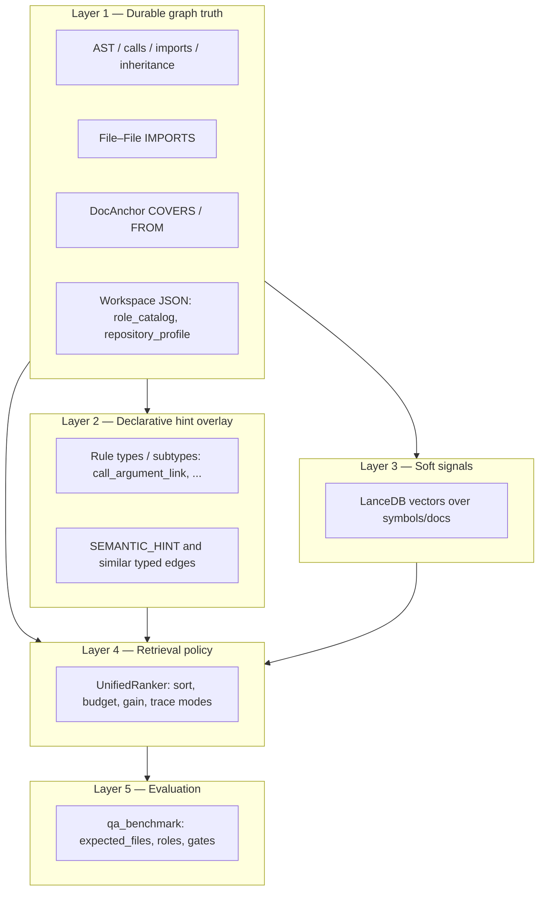

# Context retrieval — layered truth model

> **Superseded (2026-06-15).** Describes the legacy ranking cascade / `qa_benchmark` harness, removed in the cascade cleanup — axis (`sidecar/axis/`, `QA/axis_benchmark.py`) is the sole context + eval path now. Kept for historical context; see `cascade_cleanup_inventory.md`.

## Status

Draft — design contract. Implementation today is split across the indexer, `framework_hints`, LanceDB, Pass 1 role catalog, and `UnifiedRanker`; this document names the **intended boundaries** so framework-specific or ranker-only fixes do not stand in for missing graph truth.

## Recent implementation notes (2026-05-06)

- **Layer 2 hints generalized:** bundled `call_argument_link` rules now describe shared semantic subtypes (for example dependency-like marker APIs) instead of framework-named YAML defaults. Custom exact triggers may still require a resolved callee namespace prefix before emitting `SEMANTIC_HINT`.
- **Parser support generalized:** Python now keeps alias→qualified bindings for import call-sites generically, and `extract_imports()` infers stdlib / installed-package imports instead of relying on a hand-maintained framework/root allow-list. Workspace packages still win over installed-package names.
- **Layer 4 trace fallback strengthened:** trace mode now seats recovery anchors from imported modules, runtime-name seeds, and sibling-directory expansion when import topology is sparse, with explicit provenance (e.g. `recovery:import-module-trace`). Dependency-flow recovery can fulfill `config_surface` and `orchestrator` through generic dependency/provider/container signals instead of framework-symbol pairs.
- **Benchmark UX:** workspace-mode negative lookups (expected absent symbols) are printed as correct rejection instead of raw "not found" error text.

## Execution status (implemented vs pending)

### ✅ Implemented in current branch

- Layer-2 qualified-callee safety gate for DI-like hint rules.
- Generic Python import call-site qualification and external import detection, independent of a framework/root allow-list.
- Layer-4 trace recovery hardening for sparse import topology:
  - import/module recovery rows
  - runtime symbol seed rows
  - sibling-directory symbol expansion
  - generic dependency-flow role recovery for config and orchestration surfaces
- Prompt-contract/benchmark wording for expected absent workspace symbols.

### 🚧 Still pending

- Move bundled semantic hint rules to workspace-extensible typed rule instance storage.
- Strengthen Layer-1 import completeness directly in indexer (reduce ranker-side recovery dependence).
- Add explicit pool-vs-pruned telemetry per missed expected file in benchmark output.

## Problem (systemic)

Some questions require evidence in **other modules** than the primary symbol (e.g. a thin API marker vs. a runtime resolver in a sibling package). If the **durable graph** does not record that relationship, the ranker can only **heal** the gap with heuristics. Heuristics are necessary as a safety net, but they must not be the only definition of “what is connected” — otherwise every stack becomes a new patch in one Python file.

## Layer model

### Layer 1 — Durable graph truth (authoritative for “can we prove it?”)

**Owns:** Neo4j topology the indexer commits to: `File`, `Symbol`, typed call edges, `IMPORTS` between files, `AFFECTS` where materialized, `DocAnchor` links, workspace-persisted JSON that is part of the index contract (`role_catalog_json`, `repository_profile_json`).

**Rule:** If the product claims “X is part of the dependency story for Y”, that claim should **eventually** be representable as Layer 1 data (edge or file-level import), or be explicitly tagged as lower confidence (see Layer 2).

**Not sufficient alone:** static graphs often miss non-local semantic wiring; that is why Layer 2 exists.

### Layer 2 — Declarative hint overlay (authoritative for “we know the pattern”)

**Owns:** Small, **typed** rules (e.g. `call_argument_link` with metadata `kind: dependency_injection`) that create **specialized edges** (e.g. `SEMANTIC_HINT`) the extractor cannot infer. Today bundled rules live in `sidecar/context/semantic_hints.yaml`; the **target end state** is workspace-extensible rules keyed by **shared rule types / subtypes**, not per-framework filenames.

**Current safety contract:** Rules may require extractor-provided qualification metadata (example: `require_callee_qualified_prefix`) so a hint depends on both **pattern match** and **namespace evidence**.

**Rule:** Hints are **first-class** graph facts for retrieval, not ad hoc ranker constants. They should be versionable and workspace-extensible.

### Layer 3 — Soft signals (non-proof, high recall)

**Owns:** Vector similarity (LanceDB), coarse doc co-occurrence, anything that can suggest but not **prove** structure.

**Rule:** Must not be the only path to **mandatory** evidence for a trace-style question; may rank and break ties.

### Layer 4 — Retrieval policy (orchestration, not new facts)

**Owns:** `UnifiedRanker` (and friends): pool fusion, role-aware sort tiers, token budget, marginal gain, trace/ DI heuristics (e.g. resolving package imports on disk when graph import edges are missing).

**Current fallback contract:** when Layer 1 import edges are incomplete for trace-style questions, policy may add **bounded** recovery candidates from module imports, runtime symbol seeds, and same-directory neighbors; all such additions must keep explicit recovery provenance.

**Rule:** Policy may **prefer** or **include** nodes that are already in the pool; it may apply **clarified fallbacks** when Layer 1 is incomplete. It should not silently redefine “truth” without marking provenance (e.g. `recovery:import-module-trace`).

### Layer 5 — Evaluation

**Owns:** `qa_benchmark` and packs: `expected_files`, `expected_symbols`, role gates.

**Rule:** Failing a gate is a **product signal**: distinguish “graph never contained the file” (indexer / checkout) from “graph had it but policy dropped it” (Layer 4) using structured pruned reasons and future telemetry.

## Contracts (summary)

| Question | Layer that must answer it |
|----------|---------------------------|
| Is there a path in the graph from A to B? | 1 (possibly extended by 2) |
| Is this symbol in the same import cone as the target? | 1 (`IMPORTS`) or 4 (filesystem resolution fallback) |
| Should we stop selecting because gain is low? | 4 only |
| Did we satisfy the benchmark file hints? | 5 — but **root cause** is diagnosed in 1–4 |

## Migration direction (no single ticket)

1. **Strengthen Layer 1** for patterns that repeat (file-level import graph completeness; package-root resolution should live in the indexer wherever possible, with ranker recovery as a marked fallback).
2. **Move shared semantic hints** from bundled defaults to **typed workspace-extensible hint instances** (Layer 2) with stable IDs and metadata.
3. **Keep Layer 4** as a small set of **named policies** (trace breadth, doc deferral) configurable per intent, not an unbounded list of special cases.
4. **Add observability**: for each pruned or skipped high-value file, record whether the node was **absent from the pool** vs. **pruned in selection**.

## Related docs

- [spec_storage.md](spec_storage.md) — Neo4j / LanceDB split
- spec_unified_ranking.md (removed) — ranker behavior
- [spec_indexer.md](spec_indexer.md) — indexing passes
